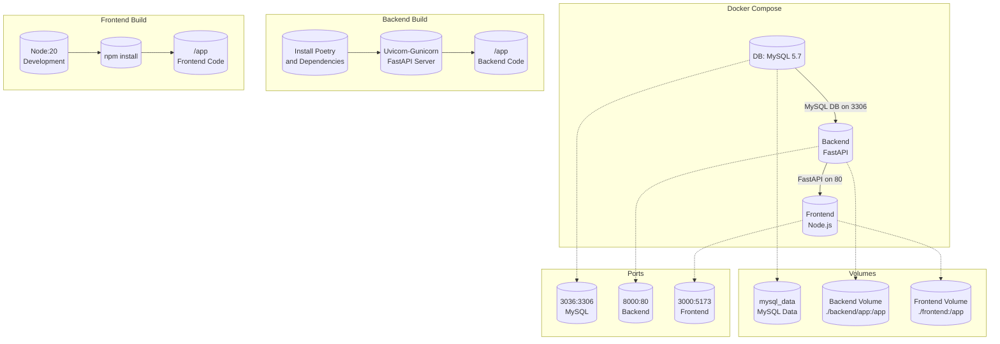

# tms




Folder Structure

```
/tms
│ └──/backend
│     └──/app
│         ├── /api                # API route handlers (controllers)
│         │   └─ /v1              # Versioning of the API
│         ├── /core               # Contains configurations
│         ├── /db                 # Database related files
│         │    └─ /models         # SQLAlchemy models
│         ├── /repositories       # Database access layer
│         ├── /schemas            # Pydantic models for request and response data validation
│         ├── /services           # Business logic layer
│         ├── /tests              # Test suites
│         └── main.py             # Entry point of the FastAPI application
│
├── /frontend
│    ├── /public                  # Public assets and static files like index.html
│    ├── /src                     # Source files for the React application
│    │    ├── /assets             # Static assets like images, styles, etc.
│    │    ├── /components         # React components
│    │    ├── /hooks              # React custom hooks
│    │    ├── /pages              # React components representing pages
│    │    └── /utils              # Utility functions and helpers
│    └── vite.config.js           # Vite configuration
│
│
├── /mysql-init         # SQL Scripts
│    └── init.sql       # Create Initial database
├── Dockerfile          # Docker configuration for building images
├──.gitignore           # Specifies intentionally untracked files to ignore
└──.pre-commit-config   # Configuration for Black (formatting) and Flake8 (linting)
```
