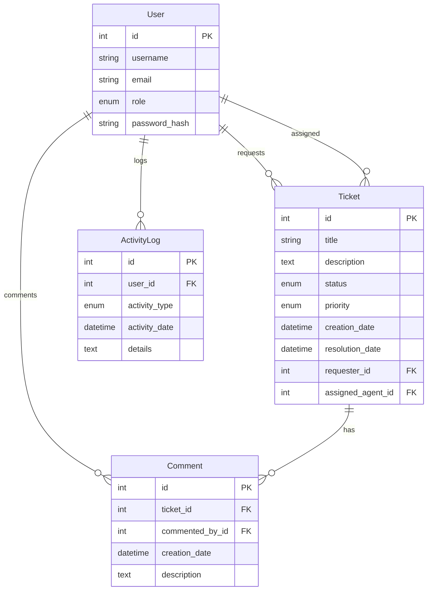

# Ticket Management System (TMS)
This application is a comprehensive **Ticket Management System** designed to optimize the handling of support requests within organizations. It introduces a role-based access control system specifically tailored for three primary user roles: **Requesters**, **Helpdesk Agents**, and **Administrators**.

- **Requesters** have the ability to easily submit and track their support tickets, ensuring transparent communication of their issues or requests. This feature is pivotal for users who require support, enabling them to communicate their needs effectively and monitor the progress of their requests.

- **Helpdesk Agents** are tasked with the crucial role of efficiently addressing and resolving the tickets. They possess the capability to view all submitted tickets, update statuses, and add comments or solutions. This role is fundamental to the operational aspect of the system, ensuring that support requests are handled promptly and proficiently.

- **Administrators** maintain overarching control over the system, with functionalities that include managing users, tickets, and overseeing all system activities. Their responsibilities extend to adding or removing users and ensuring the quality and efficiency of the ticket resolution process. Administrators ensure the system runs smoothly and effectively, adhering to organizational standards and expectations.

#### TMS Applications Infrastructure and Services Status
| Service Type                 | URL                                                                                           | Status |
|------------------------------|-----------------------------------------------------------------------------------------------|--------|
| UI                           | [https://tms-applications.com/](https://tms-applications.com/)                                 | live   |
| API                          | [https://api.tms-applications.com/](https://api.tms-applications.com/)                       | live   |
| Swagger Doc                  | [https://api.tms-applications.com/docs](https://api.tms-applications.com/docs)               | live   |
| Redoc                        | [https://api.tms-applications.com/redoc](https://api.tms-applications.com/redoc)             | live   |
| AWS Cloudfront (UI)          | [d2as3jjp2p07h5.cloudfront.net](http://d2as3jjp2p07h5.cloudfront.net)                        | live   |
| AWS Cloudfront (API)         | [d16kkv1xslifdt.cloudfront.net](http://d16kkv1xslifdt.cloudfront.net)                        | live   |
| AWS S3 bucket (UI)           | [frontend-20240315035205-hostingbucket-dev.s3.eu-west-2.amazonaws.com](http://frontend-20240315035205-hostingbucket-dev.s3.eu-west-2.amazonaws.com) | live   |
| AWS Elastic Load Balancer(API) | [awseb--awseb-lbsnntg6itof-973095914.eu-west-2.elb.amazonaws.com](http://awseb--awseb-lbsnntg6itof-973095914.eu-west-2.elb.amazonaws.com) | live   |
| AWS EBS (API)                | [backend-prod.eba-5vrqj8mx.eu-west-2.elasticbeanstalk.com](http://backend-prod.eba-5vrqj8mx.eu-west-2.elasticbeanstalk.com) | live   |
| AWS RDS (API)                | [awseb-e-uapxgq8m35-stack-awsebrdsdatabase-3c0m1cc1hhjn.czcom40qetd2.eu-west-2.rds.amazonaws.com](awseb-e-uapxgq8m35-stack-awsebrdsdatabase-3c0m1cc1hhjn.czcom40qetd2.eu-west-2.rds.amazonaws.com) | live   |


## Technology Stack and Features
### Backend

Built with **FastAPI** at its core, the backend is optimized for performance and ease of use, offering the following features:

- **FastAPI:** A modern, fast web framework for building APIs with Python 3.10+.
  - **SqlAlchemy:** A SQL toolkit and Object-Relational Mapping (ORM) library for Python.
  - **Pydantic:** Used for data validation and settings management via data parsing and serialization.
  - **fastapi-pagination:** paginate database queries and return paginated responses to clients.
  - **MySQL:** Chosen for its robustness as the SQL database solution.
  - **Security:** Implements secure password hashing and JWT token authentication following OAuth2 protocol.
  - **Code Quality:** Utilizes Black and flake8 for linting and formatting to maintain code quality.
  - **Architecture:** Employs a clean architecture including router, repository, service, and database layers.
  - **Poetry:** For efficient Python package and environment management.
- **Testing:**
  - **Pytest:** Utilized for writing and running tests. Includes support for a test database, transaction rollbacks, and reusable Pytest fixtures.

### Frontend

The frontend is powered by **React**, providing a responsive and dynamic user experience:

- **React:** A declarative, efficient, and flexible JavaScript library for building user interfaces.
  - **Vite:** A modern build tool that significantly improves the frontend development experience.
  - **State Management:** Leveraging Redux Toolkit for efficient state management.
  - **API Management:** RTK Query for optimized API calls.
  - **Styling:** Integrates TailwindCSS along with DaisyUI for a wide range of aesthetic and responsive components.
  - **Dark Mode:** Offers built-in dark mode support for improved user accessibility and preference.
  - **Code Quality:** Adopts Prettier and ESLint (following the Airbnb style guide) for code linting and formatting.
  - **Architecture:** Follows the Flux architecture pattern for predictable state management across the application.

### AWS Cloud Services
To enhance deployment, scalability, and global reach, TMS incorporates various AWS services:

- **AWS Amplify**: Utilizes S3 for storage solutions, simplifying the setup and deployment of mobile and web applications with scalable environments.
- **Elastic Beanstalk (EBS)**: Incorporates ECS on EC2 instances within a VPC for secure and scalable hosting, with ELB (Elastic Load Balancing) to distribute incoming traffic, optimizing application performance.
- **Amazon Relational Database (RDS)**: Utilizes RDS for mysql database incorporated within EBS
- **Route 53**: Manages DNS records and routes end-user requests to application endpoints, facilitating efficient and reliable access to the TMS platform.
- **CloudFront**: A content delivery network (CDN) service that accelerates the delivery of data, videos, applications, and APIs to users globally, reducing latency and improving the user experience.


### Development and Deployment

- **Docker Compose:** For simplifying the development and deployment process through containerization.
- **Pre-commit:** Configured to automatically lint and format code on every git commit, ensuring code quality from the start.

## Prerequisites

Before you begin, ensure you have the following software installed on your system:

- **Docker**: A platform for developing, shipping, and running applications. Download and install Docker from [https://www.docker.com/](https://www.docker.com/).

- **Docker Compose**: A tool for defining and running multi-container Docker applications. Follow the installation instructions at [https://docs.docker.com/compose/](https://docs.docker.com/compose/).

- **Python**: The programming language used for scripting in this setup. Version 3.10 or higher is required. Download Python from [https://www.python.org/](https://www.python.org/).

Ensure that these tools are correctly installed by running the following commands in your terminal:

```bash
docker --version
docker-compose --version
python --version
```

## Local Development

To set up the local development environment for the UI, API, and Database components, follow these steps:

1. **Start the Services**:

   Use Docker Compose to build and start the services. This will build the UI, API, and DB containers. To view the logs in real-time, simply run:
   
   ```bash
   docker-compose up --build
   ```
   If you prefer to run the services in detached mode (in the background) and not see the logs in the console, add the -d flag:
   ```bash
   docker-compose up --build -d
   ```

   If you perfer to run indidual service then run:
     
   - UI service name **frontend** running on https://localhost:3000/
   - API service name **backend** running on https://localhost:8000/
   - DB service name **db** running on https://localhost:3306/

   ```bash
   docker-compose up --build -d <replace-with-service-name>
   ```
   
   **note**
   when starting or restarting the db service, it will always execute the init.sql script in the mysql-init folder to pre-populate the database 
2. **Successful Build Output**:
   Upon executing the docker-compose up --build command, you will see output indicating the successful creation of the backend, frontend, and database containers.
   ```bash
   [+] Building 44.2s (22/22) FINISHED                                
   ...
   [+] Running 3/3
   ✔ Container tms-db-1        Created                                         
   ✔ Container tms-frontend-1  Recreated                                       
   ✔ Container tms-backend-1   Recreated                                       
    Attaching to tms-backend-1, tms-db-1, tms-frontend-1
   ...
    tms-backend-1   | INFO:     Application startup complete.
   ```
4. **Check Running Containers**:
    ```bash
    docker ps
    ```
6. **Viewing Logs**:
   ```bash
   docker logs <container_name>
   ```
   or
   ```bash
   docker-compose logs <service_name>
   ```
7. **Entering into a container environent**:
   ```bash
    docker exec -it $(docker ps -q --filter ancestor=<docker_image_name>) bash 
   ```
   or
   ```bash
    docker exec -it <container_id> bash 
   ```

### Architecture and Container Interaction of TMS Application Development Environment

### Running fastapi test
   ```bash
   docker exec $(docker ps -q --filter ancestor=tms-backend) pytest
   ```
### Running vite test
   ```bash
   docker exec $(docker ps -q --filter ancestor=tms-frontend) npm run test
   ```
# Overview of TMS monorepo 
```
/tms
│ └──/backend
│     ├── .ebextensions
│     │   └─ 01_fastapi.config
│     ├── .elasticbeanstalk
│     │   └─config.yml
│     ├── Dockerfile
│     ├── Procfile
│     ├── env
│     └──/app
│         ├── /api                # API route handlers (controllers)
│         │   └─ /v1              # Versioning of the API
│         ├── /core               # Contains configurations
│         ├── /db                 # Database related files
│         ├── /repositories       # Database access layer
│         ├── /schemas            # Pydantic models for request and response data validation
│         ├── /services           # Business logic layer
│         ├── /tests              # Test suites
│         ├── poetry.lock
│         ├── pyporoject.toml
│         ├── README.md
│         └── main.py             # Entry point of the FastAPI application
│
├── /frontend
│    ├── /public                  # Public assets and static files like index.html
│    ├── /src                     # Source files for the React application
│    │    ├── /assets             # Static assets like images, styles, etc.
│    │    ├── /components         # React components
│    │    ├── /hooks              # React custom hooks
│    │    ├── /pages              # React components representing pages
│    │    └── /utils              # Utility functions and helpers
│    └── vite.config.js           # Vite configuration
│
│
├── /mysql-init         # SQL Scripts
│    └── init.sql       # Create Initial database
├── Dockerfile          # Docker configuration for building images
├──.gitignore           # Specifies intentionally untracked files to ignore
└──.pre-commit-config   # Configuration for Black (formatting) and Flake8 (linting)
```

# Entiry Relationship Diagram 

# Backend Architecture Overview

The backend of the Ticket Management System (TMS) is designed following the principles of Clean Architecture, ensuring the separation of concerns, scalability, and ease of maintenance. This architecture allows us to decouple the system into independent layers, each with a specific responsibility, enhancing the testability and flexibility of the codebase.

## Key Components of the Architecture

- **Entities/Models (`/models`):** These are the core business objects of our application. They represent the data and the business rules that govern that data. In our context, entities include `User`, `Ticket`, and `ActivityLog`.

- **Use Cases/Services (`/services`):** This layer contains the application-specific business rules. It orchestrates the flow of data to and from the entities and directs those entities to use their business rules to achieve the goals of the use cases. Examples include user registration, ticket creation, and processing of activity logs.

- **Interface Adapters (`/api`, `/repositories`):**
  - **Controllers/Routers (`/api`):** These act as the entry point for the external world into our application. They translate HTTP requests into calls to our use case services and then return the appropriate HTTP response.
  - **Repositories (`/repositories`):** Repositories abstract the logic required to access data sources. They make it easier to perform CRUD operations on our entities without exposing the business layers to the specifics of database access.

- **Frameworks and Drivers:**
  - **FastAPI:** Serves as the web framework, enabling the creation of RESTful endpoints.
  - **SQLAlchemy:** Used as the ORM for interacting with the database, abstracted by our repository layer.
  - **Pydantic:** Provides data validation and settings management through data parsing and serialization.

## Clean Architecture Benefits in TMS

- **Independence from Frameworks:** The business logic of the application (services and entities) is not bound to the FastAPI framework, making it easier to migrate or upgrade frameworks if necessary.

- **Testability:** Each layer can be tested independently. Business logic can be tested without UI, database, web server, or any external element.

- **UI-agnostic:** The same business logic can support different user interfaces (Web API, CLI, etc.) without change.

- **Database-agnostic:** Changing the SQL database to a NoSQL database or vice versa affects only the repository layer, not the business logic.

## Flow

The `main.py` file serves as the entry point for the Ticket Management System (TMS). It initializes the application and listens to all the routes defined in the `app` object, which point to the endpoints under `api/v1`. Here's a breakdown of how the flow works within the TMS backend:

- **Route Protection:** When a route is hit, it ensures that the user is authenticated (logged in with a token). This is implemented using dependency injection to inject the database instance and RBAC (Role-Based Access Control) protection into the route handlers.

- **Data Validation and RBAC:** At this layer, the routes validate the request parameters and body using Pydantic schemas. It also handles custom business logic for response validation, such as ensuring a user has the appropriate role to access a ticket or providing different sets of tickets based on the user's role.

- **Service Layer:** The API layer calls the appropriate services within the service layer, where each service contains the business logic necessary to perform its functions. This includes interacting with the repository layer for data access and manipulation. There is also interaction between services, such as the activity log service logging actions performed by other services.

- **Sanitization and Validation:** The service layer returns a sanitized object back to the endpoint, suitable for use by the client. This object is also validated using Pydantic schemas to ensure it meets the expected format and data types.

- **Pydantic Schemas:** Within our Pydantic schemas, we define CRUD-based classes, utilize inheritance to define a base model, and implement enums for field values. We also simulate SQL joins in the response model using Pydantic schemas to craft comprehensive and relational data responses.

This structured flow ensures that the TMS backend is secure, scalable, and maintainable, with clear separations of concerns and robust data validation at every step of the process.


## Folder Structure for Clean Architecture in TMS Backend
```
/backend
│ └──/app
│    │
│    ├── /api                # API route handlers (controllers)
│    │   └── /v1             # Versioning of the API
│    │   │   ├── auth.py
│    │   │   ├── activity_logs.py
│    │   │   ├── tickets.py
│    │   │   ├── comments.py
│    │   │   └── admin.py
│    │
│    ├── /core               # Contains configurations 
│    │   └── /secuirty.py     
│    │
│    ├── /db                 # Database related files    
│    │   ├── /models         # SQLAlchemy models (entities)
│    │   │   ├── users.py
│    │   │   ├── tickets.py
│    │   │   ├── comments.py
│    │   │   └── activity_logs.py
│    │   └── database.py
│    │
│    ├── /repositories       # Abstraction layer for database access (repositories)
│    │   ├── user.py
│    │   ├── ticket.py
│    │   ├── comments.py
│    │   └── activity_log.py
│    │
│    ├── /schemas            # Pydantic models for request and response data validation
│    │   ├── user.py
│    │   ├── ticket.py
│    │   ├── comments.py
│    │   └── activity_log.py  
│    │
│    ├── /services           # Business logic layer (use cases)
│    │   ├── user.py
│    │   ├── auth.py
│    │   ├── ticket.py
│    │   ├── comment.py
│    │   └── activity_log.py  
│    │
│    ├── /tests              # Test suites for API, services, and repositories
│    │    └── /api           # Integration test
│    │    │   ├── test_auth.py
│    │    │   ├── test_tickets.py
│    │    │   └── test_comments.py
│    │    └── crud           # Unit test
│    │    │   ├── test_activity_log.py
│    │    │   ├── test_ticket.py
│    │    │   ├── test_user.py
│    │    │   └── test_comment.py
│    │    └ conftest         # contains configs, testing modules and fixtures  
│    └── main.py             # Entry point of the FastAPI application
│
├── peotry.lock              # Poetry lock file for dependency management
├── pyproject.toml           # Poetry configuration file
├── Procfile   
└── Dockerfile
```


